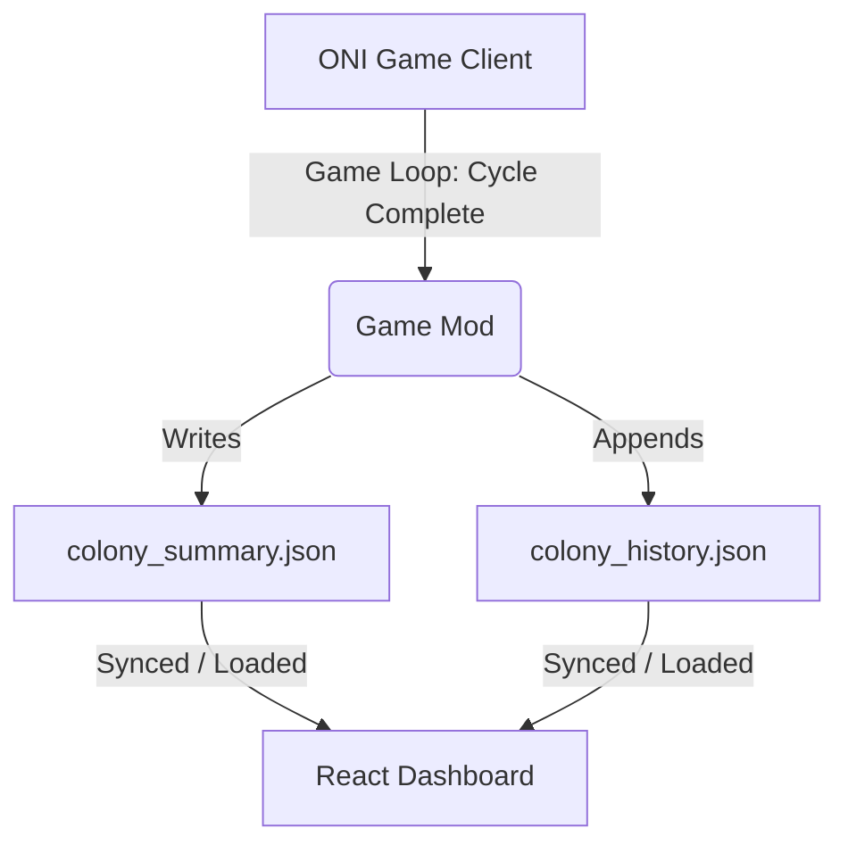

# Dashboard Not Included - Project & Mod Summary

This document provides a concise summary of the "Dashboard Not Included" React-based companion app for *Oxygen Not Included* (ONI), detailing the frontend application state, database pipelines, and the specifications for the companion C# telemetry exporter mod.

---

## 📂 Core Repository Structure & Files

* **Frontend Configuration**:
  * [package.json](file:///c:/Users/geoff/Documents/antigravity/dashboard-not-included/package.json): Handles dependencies (React 18, Vite 8, Lucide React, and `@dnd-kit` for drag-and-drop components).
  * [wrangler.jsonc](file:///c:/Users/geoff/Documents/antigravity/dashboard-not-included/wrangler.jsonc): Specifies the Cloudflare Pages Pages asset deployment parameters.
* **Core Application Logic**:
  * [src/App.jsx](file:///c:/Users/geoff/Documents/antigravity/dashboard-not-included/src/App.jsx): The centralized React controller that loads in-game JSON dumps, runs merged critter and crop calculations, and handles tab switching and persistent storage syncing.
  * [src/components/RanchBoard.jsx](file:///c:/Users/geoff/Documents/antigravity/dashboard-not-included/src/components/RanchBoard.jsx): Stable calculations panel including critter selection, occupancy margins, taming states, and expected daily calories/eggs outputs.
* **Data Integration Utilities**:
  * [sync_data.ps1](file:///c:/Users/geoff/Documents/antigravity/dashboard-not-included/sync_data.ps1): A PowerShell developer script that pulls local *Oxygen Not Included* game database files (`*.json` and image sprites) from the local user's Klei `DataDump` directory directly into the dashboard's `public/data/` resource library.

---

## 🎨 Theme & Visual Philosophy

* **Layout**: A viewport-locked (`100vh`) design ensuring all controls and readouts fit dynamically onto a single dashboard screen without page-level scrollbars.
* **Fonts**: **Oxanium** for tech readouts and telemetry tables; **Play** for structural interface copy.
* **Theme Styling**: Uses semi-translucent overlay panels over a blueprint grid, utilizing clean CSS variables mapping standard game elements:
  * **Oxygen Blue**: `#7FBFFF`
  * **Chlorine Green**: `#A8FF8C`
  * **Hydrogen Yellow / Calories Amber**: Dedicated material colors.

---

## ⚡ Core Dashboard Features

1. **Colony Demands & Aggregates Sidebar**:
   * Features a dynamic slider scaling from 1 to 100 duplicants.
   * Auto-computes vital requirements: $60\text{ kg of Oxygen/cycle}$ and $1000\text{ kcal/cycle}$ per duplicant.
   * Dynamically tracks space (stable, liquid, greenhouse tiles) and material inputs (water, dirt, coal, phosphorite, algae) demanded by all planned ranches/farms.
2. **Husbandry Planner**:
   * Track stables for Hatch, Drecko, Shine Bug, Pip, Pacu, Sweetle, and custom variants.
   * Supports wild, domesticated, happy, and glum status modifiers.
3. **Agriculture Planner**:
   * Allows crop allocations (Mealwood, Bristle Blossom, Dusk Cap, Sleet Wheat, Thimble Reed).
   * Restricts room size inputs to valid in-game greenhouse limits (12 to 96 tiles) and accounts for the 2-tile space occupied by a Farm Station.
4. **Food Calculator**:
   * Interactive diet mixer calculating kcal production splits with manual percentages lock.
5. **Database Explorer**:
   * A structural guide showing live game stats parsed from the JSON database logs (`public/data/*.json`).

---

## 💾 Live Colony Telemetry Mod Spec

To change the manual planner into an active companion dashboard, the proposed specification details a C# mod to write telemetry on every cycle completion:

### Telemetry Schema Overview

* **`colony_summary.json`**:
  * **Meta**: Colony name, cycle number.
  * **Duplicants**: Headcount, individual stress levels, calorie reserves, and active status effects.
  * **Food Storage**: Accurate mass (kg) and calculated kcal values for all stored food items.
  * **Critters & Crops**: Count of domestic/wild and happy/glum critters, active egg counts, and planter configurations.
  * **Resources**: A mass inventory of all stored elements in storage bins, liquid reservoirs, or gas tanks.

* **`colony_history.json`**:
  * Lightweight historical index log recording key metrics cycle-by-cycle (stress, population, total calories, power generation) for trend graphics.

### Planned Sync Upgrades for the Dashboard
* **Manual / Live Toggle**: Toggling to "Live Sync" locks the manual planners and populates all tables directly from the imported JSON.
* **Resource Runways**: Displays alert indicators indicating resource lifespans in cycles:
  \[
  \text{Runway (cycles)} = \frac{\text{Resource Stockpile (kg)}}{\text{Calculated Consumption (kg/cycle)}}
  \]
* **Burn-down Warnings**: Triggers red/yellow UI alerts if food storage falls below 3 cycles of duplicant consumption.
